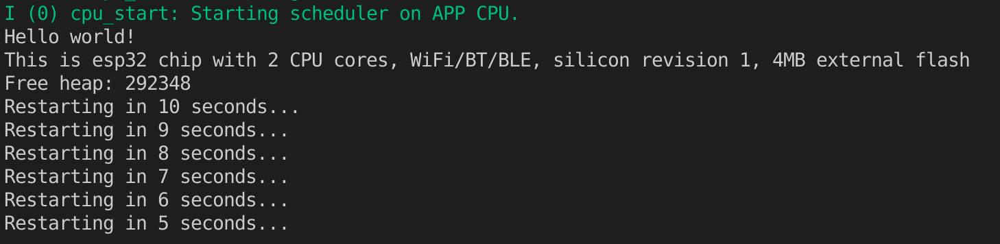

# ESP32 Hardware

## Task 00 "Hello, World"

Make a Hello World application using ESP-IDF.   

Project dir and main function here [here](t00_HelloWorld/main/hello_world_main.c)

### OUTPUT:


## Task 01 "Turn on GPIO LEDs"

Project dir and main function here [here](t01_LED/main/main/gpio_led_on.c)

### CONSOLE OUTPUT:
```
Press SW1: Turn on all LEDs
Don`t press SW2!!!
Turning off all LEDs
Turning on LED1
Turning on LED2
Turning on LED3
Turning off all LEDs
Works in loop mode, restart plz
```
